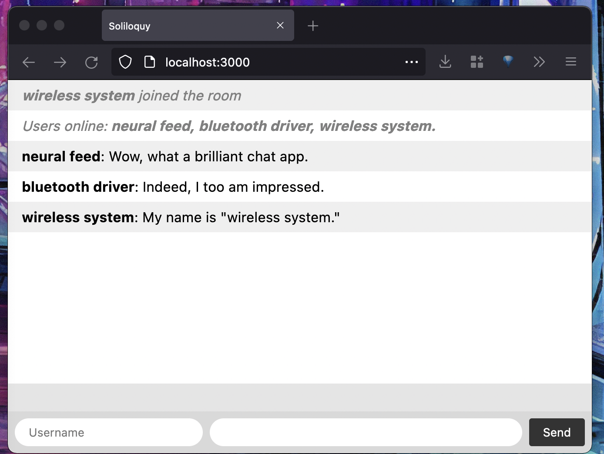
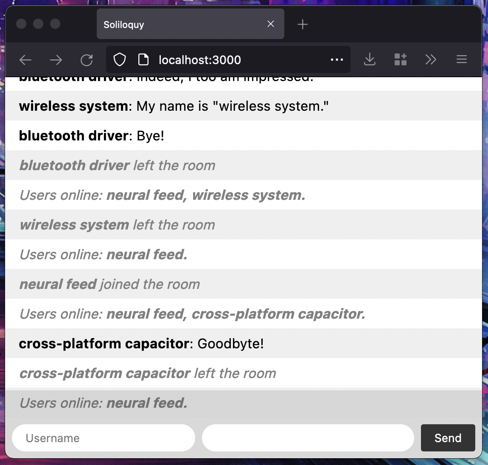
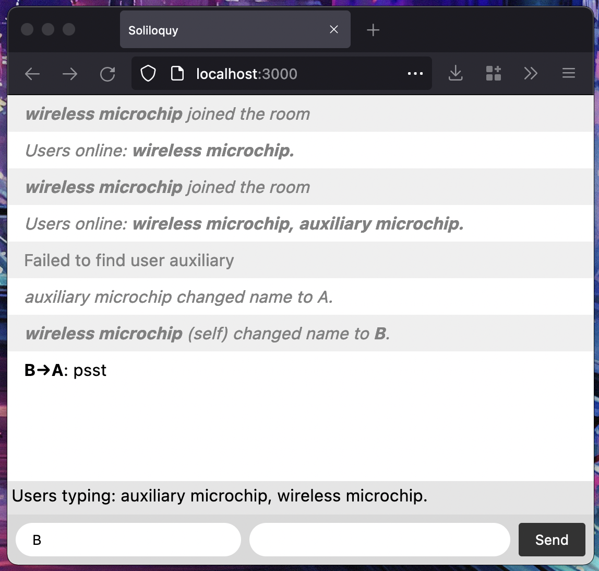

# Soliloquy

Made using [socket.io](https://socket.io) and vanilla HTML/CSS/~~J~~TS.

Here is a picture!

## Features

- Status messages: online users, connections, disconnections.

- Private messages and typing indicators: 

